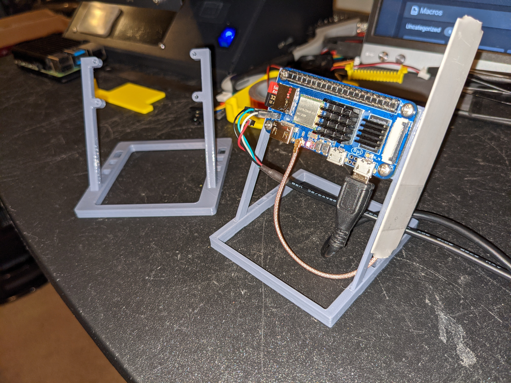

# PiZtand
Simple, quick-printing, configurable stand mount for Raspberry Pi Zero.




Also supports BananaPi M2 Zero and Radxa Zero, which have components on the back side.

Thingiverse [thing:5330551](https://www.thingiverse.com/thing:5330551)

## Directions

Screw the posts to the Pi Zero first, then insert into one of the sets of post holes in the base.

M2.5 screws should screw right into the plastic reasonably securely with no nuts needed. If the holes are too loose to hold screws, you can reduce ```screw_post_id``` from 2.5 to 2.4.

The base has 4 sets of post holes at different angles from vertical to 45 degrees.

Printing all parts at once only requires 80x95mm build surface, and prints in under an hour.

## Configurable options
The scad file has several variables that you can change to generate different configurations.<br>
For instance a [stubby](stubby.md) version.
